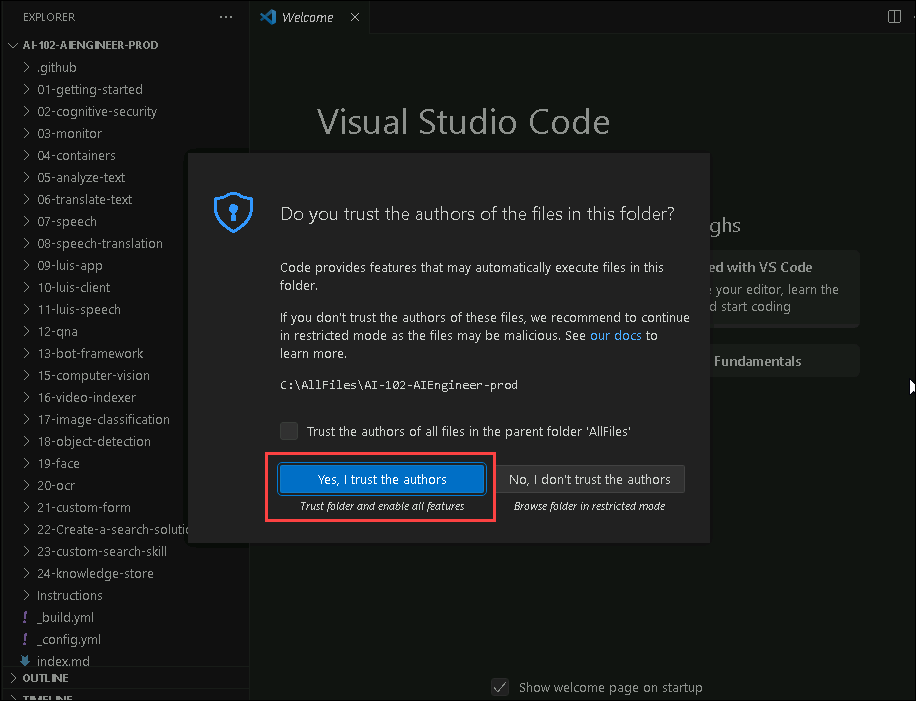

# Lab 01: Get Started with Azure AI Services

## Lab scenario

In this exercise, you'll get started with Azure AI Services by creating an **Azure AI Services** resource in your Azure subscription and using it from a client application. The goal of the exercise is not to gain expertise in any particular service, but rather to become familiar with a general pattern for provisioning and working with Azure AI services as a developer.

## Objectives

In this lab, you will complete the following tasks:

+ Task 1: Open the cloned folder in Visual Studio Code
+ Task 2: Provision an Azure AI Services resource
+ Task 3: Use a REST Interface
+ Task 4: Use an SDK

## Task 1: Open the cloned folder in Visual Studio Code

1. On the Jump-VM double click on the **Visual Studio Code** shortcut.

    

1.  Open Explorer, select **Open Folder** and open **C:\AllFiles\AI-102-AIEngineer-prod**.

    >**Note:** On the **Do you trust the authors of the files in this folder?** pop-up, select **Yes, I trust the authors**.

    >**Note:** You may be prompted to complete a 2-minute survey. Go ahead and select **No, thanks**. You may need to do this more than once.

1.  Wait while additional files are installed to support the C# code projects in the repo.

## Task 2: Provision an Azure AI Services resource

Azure AI Services are cloud-based services that encapsulate artificial intelligence capabilities you can incorporate into your applications. You can provision individual Azure AI services resources for specific APIs (for example, **Language** or **Vision**), or you can provision a single **Azure AI Services** resource that provides access to multiple Azure AI services APIs through a single endpoint and key. In this case, you'll use a single **Azure AI Services** resource.

1. On the Jump-VM, double-click on the Azure portal shortcut.

1. On **Sign in to Microsoft Azure** blade, you will see a login screen, in that enter the following email/username and then click on **Next**. 
   
   * Email/Username: <inject key="AzureAdUserEmail"></inject>

1. Now enter the following password and click on **Sign in**.
   
   * Password: <inject key="AzureAdUserPassword"></inject>

   >**Note:** If the **Stay signed in?** pop-ups, select **No**.

1. In the top search bar, search for **Azure AI services (1)**, select **Azure AI Services (2)**.

1. On the **Azure AI service** home page, from the left navigation menu, select **Azure AI services multi-service account**, select **+ Create**, and create the resource with the following settings:
    
    - **Subscription**: *Your Azure subscription*
    
    - **Resource group**: **ai-102-<inject key="DeploymentID" enableCopy="false"/>**
    
    - **Region**: *Choose any available region*
    
    - **Name**: **azureai<inject key="DeploymentID" enableCopy="false"/>**
    
    - **Pricing tier**: Standard S0

    - **By checking this box I acknowledge that I have read and understood all the terms below**: Select the checkbox 

        

1. Select **Review + create**, and once the validation passed, select **Create**.

1. Wait for deployment to complete, and then view the deployment details.

1. Select **Go to resource** and from the left navigation menu, select **Keys and Endpoint** page. This page contains the information that you will need to connect to your resource and use it from applications you develop. Specifically:
    
    - An HTTP *endpoint* to which client applications can send requests.
    
    - Two *Keys* that can be used for authentication (client applications can use either key to authenticate).
    
    - The *location* where the resource is hosted. This is required for requests to some (but not all) APIs.

        >**Note:** Copy the values of **Endpoint** and **Key 1**, in a notepad. You will use this in the next task. 

## Task 3: Use a REST Interface

The cognitive services APIs are REST-based, so you can consume them by submitting JSON requests over HTTP. In this example, you'll explore a console application that uses the **Langauge** REST API to perform language detection; but the basic principle is the same for all of the APIs supported by the Cognitive Services resource.

> **Note**: In this exercise, you can choose to use the REST API from either **C#** or **Python**. In the steps below, perform the actions appropriate for your preferred language.

1. Open Visual Studio Code, in the **Explorer** pane, browse to the **01-getting-started** folder and expand the **C-Sharp** or **Python** folder depending on your language preference.

1. View the contents of the **rest-client** folder, and note that it contains a file for configuration settings:
    
    - **C#**: appsettings.json
    
    - **Python**: .env

        >**Note:** Open the configuration file and update the configuration values it contains to reflect the **endpoint** and an authentication **key** for your cognitive services resource. Save your changes, by pressing **CTRL + S** on the keyboard.

1. Note that the **rest-client** folder contains a code file for the client application:

    - **C#**: Program.cs
    
    - **Python**: rest-client.py

    Open the code file and review the code it contains, the following details:
    
    - Various namespaces are imported to enable HTTP communication
    
    - Code in the **Main** function retrieves the endpoint and key for your cognitive services resource - these will be used to send REST requests to the Text Analytics service.
    
    - The program accepts user input, and uses the **GetLanguage** function to call the Text Analytics language detection REST API for your cognitive services endpoint to detect the language of the text that was entered.
    
    - The request sent to the API consists of a JSON object containing the input data - in this case, a collection of **document** objects, each of which has an **id** and **text**.
    
    - The key for your service is included in the request header to authenticate your client application.
    
    - The response from the service is a JSON object, which the client application can parse.

1. On the Lab-VM, in the **Type here to search** bar, search for **Command Prompt**, then right-click on it, and select **Run as administrator**.

1. Run these following commands, for adding the path:

    ```
    setx path1 "%PATH%;C:\Python313\Scripts;"
    ```

    ```
    setx path "%PATH%;C:\Python313;"
    ```

1. Navigate, back to the **Visual Studio Code**.

1. Right-click on the **rest-client** folder and open an integrated terminal. Then enter the following language-specific command to run the program:

    **C#**

    ```
    dotnet run
    ```

    **Python**
 
    ```
    python -m pip install --user python-dotenv
    ```

    ```
    python rest-client.py
    ```

1. When prompted, enter some text and review the language that is detected by the service, which is returned in the JSON response. For example, try entering "Hello", "Bonjour", and "Hola".

1. When you have finished testing the application, enter "quit" to stop the program.

## Task 4: Use an SDK

You can write code that consumes cognitive services REST APIs directly, but there are software development kits (SDKs) for many popular programming languages, including Microsoft C#, Python, and Node.js. Using an SDK can greatly simplify development of applications that consume cognitive services.

1. In Visual Studio Code, in the **Explorer** pane, in the **01-getting-started** folder, expand the **C-Sharp** or **Python** folder depending on your language preference.

1. Right-click the **sdk-client** folder and open an integrated terminal. Then install the Text Analytics SDK package by running the appropriate command for your language preference:

    **C#**

    ```
    dotnet add package Azure.AI.TextAnalytics --version 5.3.0
    ```

    **Python**

    ```
    pip install azure-ai-textanalytics==5.3.0
    ```

1. View the contents of the **sdk-client** folder, and note that it contains a file for configuration settings:
    
    - **C#**: appsettings.json
    
    - **Python**: .env

    Open the configuration file and update the configuration values it contains to reflect the **endpoint** and an authentication **key** for your cognitive services resource. Save your changes.
    
1. Note that the **sdk-client** folder contains a code file for the client application:

    - **C#**: Program.cs
    - **Python**: sdk-client.py

    Open the code file and review the code it contains, noting the following details:
    
    - The namespace for the SDK you installed is imported
    
    - Code in the **Main** function retrieves the endpoint and key for your cognitive services resource - these will be used with the SDK to create a client for the Text Analytics service.
    
    - The **GetLanguage** function uses the SDK to create a client for the service, and then uses the client to detect the language of the text that was entered.

1. Return to the integrated terminal for the **sdk-client** folder, and enter the following command to run the program:

    **C#**

    ```
    dotnet run
    ```

    **Python**

    ```
    python sdk-client.py
    ```

1. When prompted, enter some text and review the language that is detected by the service. For example, try entering "Goodbye", "Au revoir", and "Hasta la vista".

1. When you have finished testing the application, enter "quit" to stop the program.

> **Note**: Some languages that require Unicode character sets may not be recognized in this simple console application.

> **Congratulations** on completing the task! Now, it's time to validate it. Here are the steps:
> - Navigate to the Lab Validation Page, from the upper right corner in the lab guide section.
> - Hit the Validate button for the corresponding task. If you receive a success message, you can proceed to the next task. 
> - If not, carefully read the error message and retry the step, following the instructions in the lab guide.
> - If you need any assistance, please contact us at labs-support@spektrasystems.com. We are available 24/7 to help you out.

### Review
In this lab, you have completed:

- Opened the cloned folder in Visual Studio Code
- Provisioned a Cognitive Services resource
- Used a REST Interface
- Used an SDK

## You have successfully completed the lab
