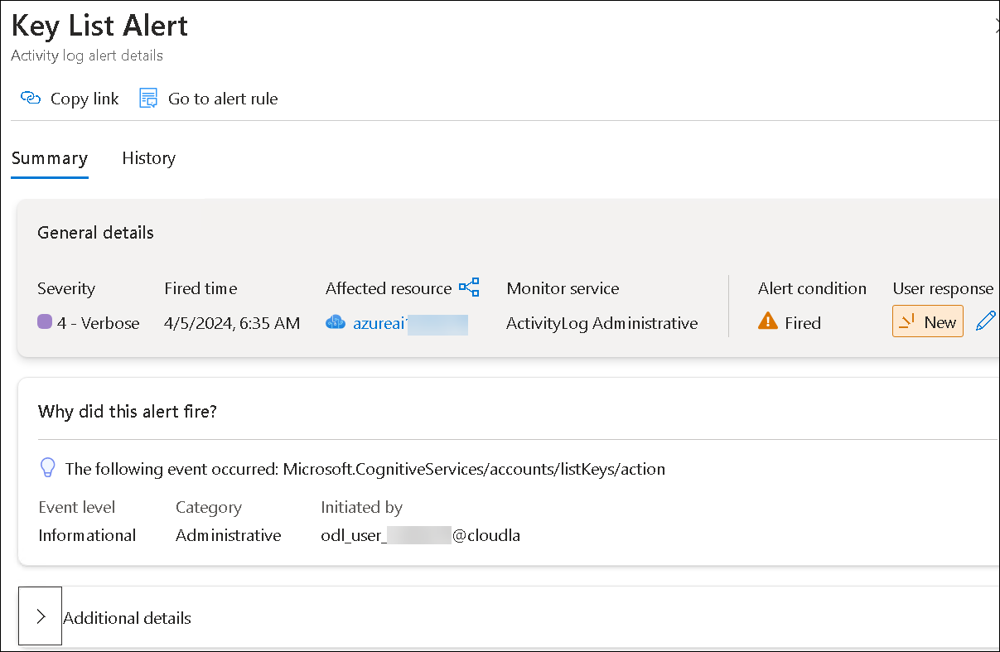
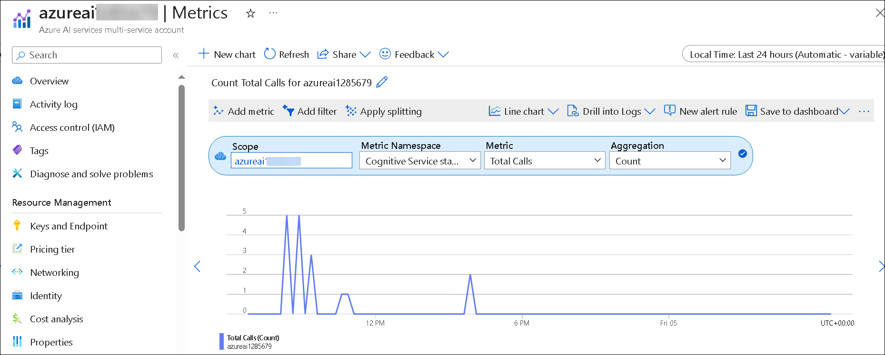

# Exercise 03: Monitor Azure AI services

## Lab scenario

Azure AI Services can be a critical part of an overall application infrastructure. It's important to be able to monitor activity and get alerted to issues that may need attention.

## Objectives

In this lab, you will complete the following tasks:

+ Task 1: Configure an alert
+ Task 2: Visualize a metric

## Task 1: Configure an alert

Let's start monitoring by defining an alert rule so you can detect activity in your Azure AI services resource.

1. In the Azure portal, go to your **Azure AI services** resource and view its **Alerts** page under the **Monitoring** section.

1. Select **+ Create** dropdown, and select **Alert rule**.

1. In the **Create an alert rule** page, under **Scope**, verify that the your Azure AI services resource is listed.

1. Select **Condition** tab, and view the **Select a signal** pane that appears on the right, where you can select a signal type to monitor.

1. In the **Signal type** list, under **Activity Log**, in the filtered list, select **List Keys**, and select **Apply**.

1. Review the activity over the past 6 hours.

1. Select the **Actions** tab. Note that you can specify an *action group*. This enables you to configure automated actions when an alert is fired - for example, sending an email notification. We won't do that in this exercise; but it can be useful to do this in a production environment.

1. In the **Details** tab, set the **Alert rule name** to **Key List Alert**.

1. Select **Review + create**.

1. Review the configuration for the alert. Select **Create** and wait for the alert rule to be created. 

1. In Visual Studio Code, right-click the **03-monitor** folder and open an integrated terminal.

1. Switch back to the browser containing the Azure portal, and refresh your **Alerts page**. You should see a **Sev 4** alert listed in the table 

    >**Note:** If it doesn't show up, wait up to five minutes and refresh again.

1. Select the alert to see its details.

    

> **Congratulations** on completing the task! Now, it's time to validate it. Here are the steps:
> - Navigate to the Lab Validation Page, from the upper right corner in the lab guide section.
> - Hit the Validate button for the corresponding task. If you receive a success message, you can proceed to the next task. 
> - If not, carefully read the error message and retry the step, following the instructions in the lab guide.
> - If you need any assistance, please contact us at labs-support@spektrasystems.com. We are available 24/7 to help you out.

## Task 2: Visualize a metric

As well as defining alerts, you can view metrics for your Azure AI services resource to monitor its utilization.

1. In the Azure portal, in the page for your Azure AI services resource, select **Metrics** under the **Monitoring** section, from the left navigation menu.

1. If there is no existing chart, select **+ New chart**. Then in the **Metric** list, review the possible metrics you can visualize and select **Total Calls**.

1. In the **Aggregation** list, select **Count**.  This will enable you to monitor the total calls to you Cognitive Service resource; which is useful in determining how much the service is being used over a period of time.

    

1. To generate some requests to your cognitive service, you will use **curl** - a command line tool for HTTP requests. In Visual Studio Code, in the **03-monitor** folder, open **rest-test.cmd** and edit the **curl** command it contains (shown below), replacing *&lt;yourEndpoint&gt;* and *&lt;yourKey&gt;* with your endpoint URI and **Key1** key to use the Text Analytics API in your Azure AI services resource.

    ```
    curl -X POST "<yourEndpoint>/text/analytics/v3.1/languages?" -H "Content-Type: application/json" -H "Ocp-Apim-Subscription-Key: <yourKey>" --data-ascii "{'documents':           [{'id':1,'text':'hello'}]}"
    ```

1. Save your changes, and then in the integrated terminal for the **03-monitor** folder, run the following command:

    ```
    .\rest-test
    ```

    >**Note:** The command returns a JSON document containing information about the language detected in the input data (which should be English).

1. Re-run the **.\rest-test** command multiple times to generate some call activity (you can use the **^** key to cycle through previous commands).

1. Return to the **Metrics** page in the Azure portal and refresh the **Total Calls** count chart. It may take a few minutes for the calls you made using *curl* to be reflected in the chart - keep refreshing the chart until it updates to include them.

### Review
In this lab, you have completed:

- Configured an alert
- Visualized a metric

## You have successfully completed the lab
