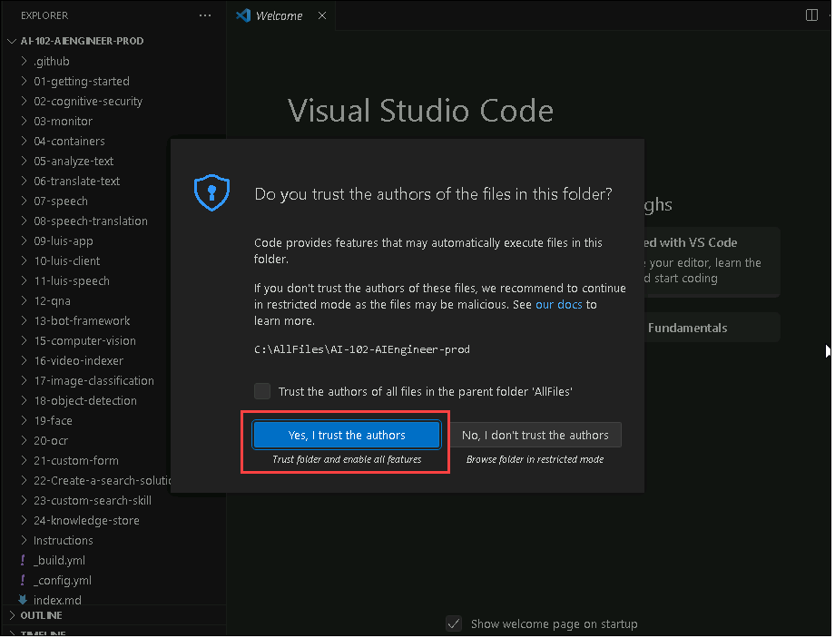

# Detect and Analyze Faces

The ability to detect and analyze human faces is a core AI capability. In this exercise, you'll explore two Azure Cognitive Services that you can use to work with faces in images: the **Computer Vision** service, and the **Face** service.

## Open the cloned folder in Visual Studio Code.

1.  Start Visual Studio Code (the program icon is pinned to the bottom taskbar).

     

2.  Open a file, From the top-left options, Click on **file->Open Folder** and navigate to **C:\AllFiles\AI-102-AIEngineer-prod**.

    **Note:** You may be prompted to complete a 2-minute survey. Go ahead and select **No, thanks**. You may need to do this more than once.

3. You will get a pop-up stating **Do you trust the authors of the files in this folder?** Select **Yes, I turst the authors**.

    

## Provision a Cognitive Services resource

If you don't already have one in your subscription, you'll need to provision a **Azure AI Services** resource.

1. Open the Azure portal at `https://portal.azure.com`, and sign in using the Microsoft account associated with your Azure subscription.

2. Select the **&#65291;Create a resource** button, search for *cognitive services*, and create a **Azure AI Services** resource with the following settings:
    - **Subscription**: *Your Azure subscription*
    - **Resource group**: *Choose or create a resource group Ai-102-DeploymentID*
    - **Region**: *Choose any available region*
    - **Name**: *Enter a unique name*
    - **Pricing tier**: Standard S0

3. Select the required checkboxes and create the resource.

4. Select **Review + Create** to navigate to the **Review + Create** tab, and then select **Create**.

5. Wait for deployment to complete, and and then click **Go to resource**.

6. On **Azure AI Services** blade, click on **Keys and Endpoint** under Resource Management. You will need the **endpoint** and one of the **keys** from this page in the next procedure.


## Prepare to use the Azure AI Vision SDK

In this exercise, you'll complete a partially implemented client application that uses the Azure AI Vision SDK to analyze faces in an image.

1. In Visual Studio Code, in the **Explorer** pane, browse to the **19-face** folder and expand the **C-Sharp** folder depending on your language preference.

2. Right-click the **computer-vision** folder and open an integrated terminal. Then install the Computer Vision SDK package by running the below mentioned command:

    **C#**

    ```
    dotnet add package Microsoft.Azure.CognitiveServices.Vision.ComputerVision --version 6.0.0
    ```
        
3. View the contents of the **computer-vision** folder, and note that it contains a file for configuration settings:
   
    - **C#**: appsettings.json

4. Open the configuration file and update the configuration values it contains to reflect the **endpoint** and an authentication **key** for your cognitive services resource. Save your changes.

5. Note that the **computer-vision** folder contains a code file for the client application:

    - **C#**: Program.cs

6. Open the code file and at the top, under the existing namespace references, find the comment **Import namespaces**. Then, under this comment, add the following code to import the namespaces you will need to use the Computer Vision SDK:

    **C#**

    ```C#
    // import namespaces
    using Microsoft.Azure.CognitiveServices.Vision.ComputerVision;
    using Microsoft.Azure.CognitiveServices.Vision.ComputerVision.Models;
    ```

## View the image you will analyze

In this exercise, you will use the Computer Vision service to analyze an image of people.

1. In Visual Studio Code, expand the **computer-vision** folder and the **images** folder it contains.

2. Select the **people.jpg** image to view it.

## Detect faces in an image

Now you're ready to use the SDK to call the Computer Vision service and detect faces in an image.

1. In the code file for your client application (**Program.cs**), in the **Main** function, note that the code to load the configuration settings has been provided. Then find the comment **Authenticate Computer Vision client**. Then, under this comment, add the following code to create and authenticate a Computer Vision client object:

    **C#**

    ```C#
    // Authenticate Computer Vision client
    ApiKeyServiceClientCredentials credentials = new ApiKeyServiceClientCredentials(cogSvcKey);
    cvClient = new ComputerVisionClient(credentials)
    {
        Endpoint = cogSvcEndpoint
    };
    ```

2. In the **Main** function, under the code you just added, note that the code specifies the path to an image file and then passes the image path to a function named **AnalyzeFaces**. This function is not yet fully implemented.

3. In the **AnalyzeFaces** function, under the comment **Specify features to be retrieved (faces)**, add the following code:

    **C#**

    ```C#
    // Specify features to be retrieved (faces)
    List<VisualFeatureTypes?> features = new List<VisualFeatureTypes?>()
    {
        VisualFeatureTypes.Faces
    };
    ```

4. In the **AnalyzeFaces** function, under the comment **Get image analysis**, add the following code:

     **C#**

    ```C
     // Get image analysis
     using (var imageData = File.OpenRead(imageFile))
     {    
         var analysis = await cvClient.AnalyzeImageInStreamAsync(imageData, features);

         // Get faces
         if (analysis.Faces.Count > 0)
         {
             Console.WriteLine($"{analysis.Faces.Count} faces detected.");

         // Prepare image for drawing
         Image image = Image.FromFile(imageFile);
         Graphics graphics = Graphics.FromImage(image);
         Pen pen = new Pen(Color.LightGreen, 3);
         Font font = new Font("Arial", 3);
         SolidBrush brush = new SolidBrush(Color.LightGreen);

         // Draw and annotate each face
         foreach (var face in analysis.Faces)
         {
            var r = face.FaceRectangle;
            Rectangle rect = new Rectangle(r.Left, r.Top, r.Width, r.Height);
            graphics.DrawRectangle(pen, rect);
            string annotation = $"Person at approximately {r.Left}, {r.Top}";
            graphics.DrawString(annotation,font,brush,r.Left, r.Top);
         }

         // Save annotated image
         String output_file = "detected_faces.jpg";
         image.Save(output_file);
         Console.WriteLine(" Results saved in " + output_file);   
       }
   }        
    ```

6. Save your changes and return to the integrated terminal for the **computer-vision** folder, and enter the following command to run the program:

    **C#**

    ```
    dotnet run
    ```

7. Observe the output, which should indicate the number of faces detected.

8. View the **detected_faces.jpg** file that is generated in the same folder as your code file to see the annotated faces. In this case, your code has used the attributes of the face to label the location of the top left of the box, and the bounding box coordinates to draw a rectangle around each face.

## Prepare to use the Face SDK

While the **Azure AI Vision** service offers basic face detection (along with many other image analysis capabilities), the **Face** service provides more comprehensive functionality for facial analysis and recognition.

1. In Visual Studio Code, in the **Explorer** pane, browse to the **19-face** folder and expand the **C-Sharp** folder.

2. Right-click the **face-api** folder and open an integrated terminal. Then install the Face SDK package by running the below mentioned command:

    **C#**

    ```
    dotnet add package Microsoft.Azure.CognitiveServices.Vision.Face --version 2.6.0-preview.1
    ```
    
3. View the contents of the **face-api** folder, and note that it contains a file for configuration settings:
   
    - **C#**: appsettings.json

4. Open the configuration file and update the configuration values it contains to reflect the **endpoint** and an authentication **key** for your cognitive services resource. Save your changes.

5. Note that the **face-api** folder contains a code file for the client application:

    - **C#**: Program.cs

6. Open the code file and at the top, under the existing namespace references, find the comment **Import namespaces**. Then, under this comment, add the code to import the namespaces you will need to use the Computer Vision SDK:

    **C#**

    ```C#
    // Import namespaces
    using Microsoft.Azure.CognitiveServices.Vision.Face;
    using Microsoft.Azure.CognitiveServices.Vision.Face.Models;
    ```

8. In the **Main** function, note that the code to load the configuration settings has been provided. Then find the comment **Authenticate Face client**. Then, under this comment, add the following code to create and authenticate a **FaceClient** object:

    **C#**

    ```C#
    // Authenticate Face client
    ApiKeyServiceClientCredentials credentials = new ApiKeyServiceClientCredentials(cogSvcKey);
    faceClient = new FaceClient(credentials)
    {
        Endpoint = cogSvcEndpoint
    };
    ```

9. In the **Main** function, under the code you just added, note that the code displays a menu that enables you to call functions in your code to explore the capabilities of the Face service. You will implement these functions in the remainder of this exercise.

## Detect and analyze faces

One of the most fundamental capabilities of the Face service is to detect faces in an image, and determine their attributes, such as head pose, blur, the presence of spectacles, and so on.

1. In the code file for your application, in the **Main** function, examine the code that runs if the user selects menu option **1**. This code calls the **DetectFaces** function, passing the path to an image file.
   
3. Find the **DetectFaces** function in the code file, and under the comment **Specify facial features to be retrieved**, add the following code:

    **C#**

    ```C#
    // Specify facial features to be retrieved
    List<FaceAttributeType?> features = new List<FaceAttributeType?>
    {
        FaceAttributeType.Occlusion,
        FaceAttributeType.Blur,
        FaceAttributeType.Glasses
    };
    ```

4. In the **DetectFaces** function, under the code you just added, find the comment **Get faces** and add the following code:

     **C#**

     ```C
     // Get faces
     using (var imageData = File.OpenRead(imageFile))
     {    
         var detected_faces = await faceClient.Face.DetectWithStreamAsync(imageData, returnFaceAttributes: features, returnFaceId: false);

         if (detected_faces.Count > 0)
         {
             Console.WriteLine($"{detected_faces.Count} faces detected.");

             // Prepare image for drawing
             Image image = Image.FromFile(imageFile);
             Graphics graphics = Graphics.FromImage(image);
             Pen pen = new Pen(Color.LightGreen, 3);
             Font font = new Font("Arial", 4);
             SolidBrush brush = new SolidBrush(Color.Black);
             int faceCount=0;

             // Draw and annotate each face
             foreach (var face in detected_faces)
             {
                 faceCount++;
                 Console.WriteLine($"\nFace number {faceCount}");
            
                 // Get face properties
                 Console.WriteLine($" - Mouth Occluded: {face.FaceAttributes.Occlusion.MouthOccluded}");
                 Console.WriteLine($" - Eye Occluded: {face.FaceAttributes.Occlusion.EyeOccluded}");
                 Console.WriteLine($" - Blur: {face.FaceAttributes.Blur.BlurLevel}");
                 Console.WriteLine($" - Glasses: {face.FaceAttributes.Glasses}");

                 // Draw and annotate face
                 var r = face.FaceRectangle;
                 Rectangle rect = new Rectangle(r.Left, r.Top, r.Width, r.Height);
                 graphics.DrawRectangle(pen, rect);
                 string annotation = $"Face ID: {face.FaceId}";
                 graphics.DrawString(annotation,font,brush,r.Left, r.Top);
             }

             // Save annotated image
             String output_file = "detected_faces.jpg";
             image.Save(output_file);
             Console.WriteLine(" Results saved in " + output_file);   
         }
     }
     ```

4. Examine the code you added to the **DetectFaces** function. It analyzes an image file and detects any faces it contains, including attributes for age, emotions, and the presence of spectacles. The details of each face are displayed, including a unique face identifier that is assigned to each face; and the location of the faces is indicated on the image using a bounding box.

5. Save your changes and return to the integrated terminal for the **face-api** folder, and enter the following command to run the program:

    **C#**

    ```
    dotnet run
    ```

    *The C# output may display warnings about asynchronous functions now using the **await** operator. You can ignore these.*

6. When prompted, enter **1** and observe the output, which should include the ID and attributes of each face detected.

7. View the **detected_faces.jpg** file that is generated in the same folder as your code file to see the annotated faces.

## More information

There are several additional features available within the **Face** service, but following the [Responsible AI Standard](https://aka.ms/aah91ff) those are restricted behind a Limited Access policy. These features include identifying, verifying, and creating facial recognition models. To learn more and apply for access, see the [Limited Access for Cognitive Services](https://docs.microsoft.com/en-us/azure/cognitive-services/cognitive-services-limited-access).

For more information about using the **Azure AI Vision** service for face detection, see the [Computer Vision documentation](https://docs.microsoft.com/azure/cognitive-services/computer-vision/concept-detecting-faces).

To learn more about the **Face** service, see the [Face documentation](https://docs.microsoft.com/azure/cognitive-services/face/).
