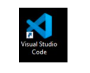

# Read Text in Images

Optical character recognition (OCR) is a subset of computer vision that deals with reading text in images and documents. The **Computer Vision** service provides two APIs for reading text, which you'll explore in this exercise.

## Open the cloned folder in Visual Studio Code.

1.  Start Visual Studio Code (the program icon is pinned to the Desktop).

     

2.  Open a file, From the top-left options, Click on **file->Open Folder** and navigate to **C:\LabFiles** choose **AI-102-AIEngineer-master** folder and select **select folder**

    **Note:** You may be prompted to complete a 2-minute survey. Go ahead and select **No, thanks**. You may need to do this more than once.

3.  Wait while additional files are installed to support the C# code projects in the repo.


## Provision a Cognitive Services resource

If you don't already have one in your subscription, you'll need to provision a **Azure AI Services** resource.

1. Open the Azure portal at `https://portal.azure.com`, and sign in using the Microsoft account associated with your Azure subscription.
2. Select the **&#65291;Create a resource** button, search for *Azure AI services*, select **Azure AI Services**, and create an Azure AI services multi-service account resource with the following setting
    - **Subscription**: *Your Azure subscription*
    - **Resource group**: *Ai-102-<inject key="DeploymentID" enableCopy="false" /></inject>*.
    - **Region**: Choose same as resource group location.
    - **Name**: *AIservice-<inject key="DeploymentID" enableCopy="false" /></inject>**.
    - **Pricing tier**: Standard S0
    - **Responsible AI Notice**: Agree.
3. Select **Review + create** and **Create**.
4. Wait for deployment to complete, and then view the deployment details.
5. When the resource has been deployed, go to it and view its **Keys and Endpoint** page. You will need the endpoint and one of the keys from this page in the next procedure.

## Prepare to use the Azure AI Vision SDK

In this exercise, you'll complete a partially implemented client application that uses the Azure AI Vision SDK to read text.

> **Note**: You can choose to use the SDK for **C#**. In the steps below, perform the actions appropriate for your preferred language.

1. In Visual Studio Code, in the **Explorer** pane, browse to the **20-ocr** folder and expand the **C-Sharp** folder depending on your language preference.
2. Right-click the **read-text** folder and open an integrated terminal. Then install the Azure AI Vision SDK package by running the appropriate command for your language preference:

**C#**

```
dotnet add package Microsoft.Azure.CognitiveServices.Vision.ComputerVision --version 6.0.0
```


3. View the contents of the **read-text** folder, and note that it contains a file for configuration settings:
    - **C#**: appsettings.json

    Open the configuration file and update the configuration values it contains to reflect the **endpoint** and an authentication **key** for your Azure AI services resource. Save your changes.
4. Note that the **read-text** folder contains a code file for the client application:

    - **C#**: Program.cs

    Open the code file and at the top, under the existing namespace references, find the comment **Import namespaces**. Then, under this comment, add the following language-specific code to import the namespaces you will need to use the Azure AI Vision SDK:

**C#**

```C#
// import namespaces
using Microsoft.Azure.CognitiveServices.Vision.ComputerVision;
using Microsoft.Azure.CognitiveServices.Vision.ComputerVision.Models;
```


5. In the code file for your client application, in the **Main** function, note that the code to load the configuration settings has been provided. Then find the comment **Authenticate Azure AI Vision client**. Then, under this comment, add the following language-specific code to create and authenticate a Azure AI Vision client object:

**C#**

```C#
// Authenticate Azure AI Vision client
ApiKeyServiceClientCredentials credentials = new ApiKeyServiceClientCredentials(cogSvcKey);
cvClient = new ComputerVisionClient(credentials)
{
    Endpoint = cogSvcEndpoint
};
```

## Use the Read API to read text from an image

The **Read** API uses a newer text recognition model and generally performs better for larger images that contain a lot of text, but will work for any amount of text. It also supports text extraction from *.pdf* files, and can recognize both printed text and handwritten text in multiple languages.

The **Read** API uses an asynchronous operation model, in which a request to start text recognition is submitted; and the operation ID returned from the request can subsequently be used to check progress and retrieve results.

1. In the code file for your application, in the **Main** function, examine the code that runs if the user selects menu option **1**. This code calls the **GetTextRead** function, passing the path to an image  file.
2. In the **read-text/images** folder, click on **Lincoln.jpg** to view the file that your code will process.
3. Back in the code file in Visual Studio Code, find the **GetTextRead** function, and under the existing code that prints a message to the console, add the following code:

**C#**

```C#
// Use Read API to read text in image
using (var imageData = File.OpenRead(imageFile))
{    
    var readOp = await cvClient.ReadInStreamAsync(imageData);

    // Get the async operation ID so we can check for the results
    string operationLocation = readOp.OperationLocation;
    string operationId = operationLocation.Substring(operationLocation.Length - 36);

    // Wait for the asynchronous operation to complete
    ReadOperationResult results;
    do
    {
        Thread.Sleep(1000);
        results = await cvClient.GetReadResultAsync(Guid.Parse(operationId));
    }
    while ((results.Status == OperationStatusCodes.Running ||
            results.Status == OperationStatusCodes.NotStarted));

    // If the operation was successfully, process the text line by line
    if (results.Status == OperationStatusCodes.Succeeded)
    {
        var textUrlFileResults = results.AnalyzeResult.ReadResults;
        foreach (ReadResult page in textUrlFileResults)
        {
            foreach (Line line in page.Lines)
            {
                Console.WriteLine(line.Text);
                
                // Uncomment the following line if you'd like to see the bounding box 
                //Console.WriteLine(line.BoundingBox);
            }
        }
    }
}  
```

4. Examine the code you added to the **GetTextRead** function. It submits a request for a read operation, and then repeatedly checks status until the operation has completed. If it was successful, the code processes the results by iterating through each page, and then through each line.
5. Save your changes and return to the integrated terminal for the **read-text** folder, and enter the following command to run the program:

**C#**

```
dotnet run
```

6. When prompted, enter **1** and observe the output, which is the text extracted from the image.
7. If desired, go back to the code you added to **GetTextRead** and find the comment in the nested `for` loop at the end, uncomment the last line, save the file, and rerun steps 5 and 6 above to see the bounding box of each line. Be sure to re-comment that line and save the file before moving on.

## Use the Read API to read text from a document

1. In the code file for your application, in the **Main** function, examine the code that runs if the user selects menu option **2**. This code calls the **GetTextRead** function, passing the path to a PDF document file.
2. In the **read-text/images** folder, right-click **Rome.pdf** and select **Reveal in File Explorer**. Then in File Explorer, open the PDF file to view it.
3. Return to the integrated terminal for the **read-text** folder, and enter the following command to run the program:

**C#**

```
dotnet run
```

6. When prompted, enter **2** and observe the output, which is the text extracted from the document.

## Read handwritten text

In addition to printed text, the **Read** API can extract handwritten text in English..

1. In the code file for your application, in the **Main** function, examine the code that runs if the user selects menu option **3**. This code calls the **GetTextRead** function, passing the path to an image file.
2. In the **read-text/images** folder, open **Note.jpg** to view the image that your code will process.
3. In the integrated terminal for the **read-text** folder, and enter the following command to run the program:

**C#**

```
dotnet run
```


4. When prompted, enter **3** and observe the output, which is the text extracted from the document.

## More information

For more information about using the **Azure AI Vision** service to read text, see the [Azure AI Vision documentation](https://docs.microsoft.com/azure/cognitive-services/computer-vision/concept-recognizing-text).
